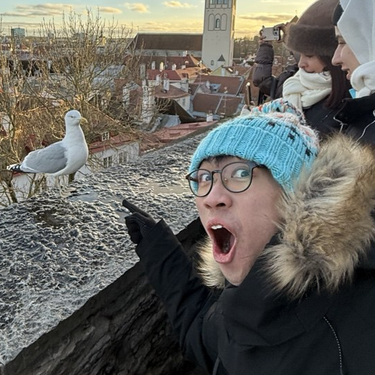
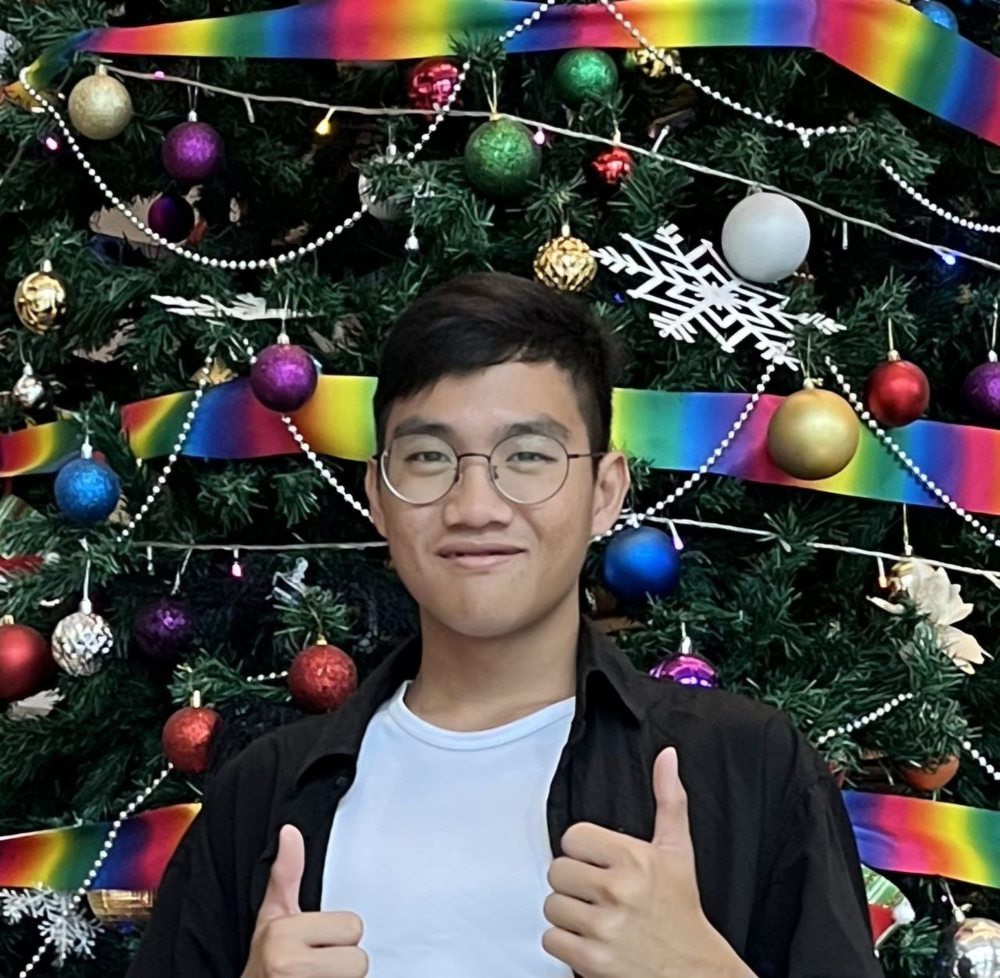
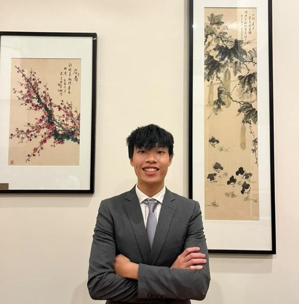
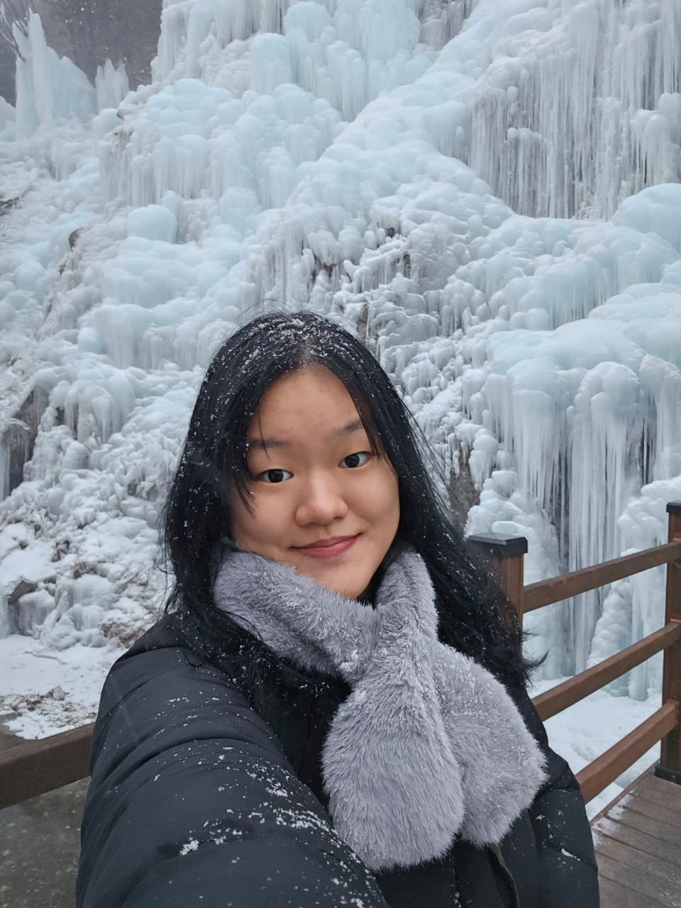
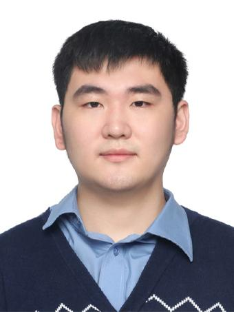

# About Us

We are a team based in the [School of Computing, National University of Singapore](http://www.comp.nus.edu.sg).

You can reach us at the email `seer[at]comp.nus.edu.sg`

## Project team

### Caleb Goh

[[github](https://github.com/calebanana)]
[[portfolio](team/calebanana.md)]

* Role: Scheduling and tracking
* Responsibilities: Defining, assigning, and tracking project tasks

### Danny Chan

[[github](http://github.com/dannyoncode)]
[[portfolio](team/dannyoncode.md)]

* Role: Integration
* Responsibilities: In charge of versioning of the code, maintaining the code repository, integrating various parts of the software to create a whole.

### Swee Kah Ho

[[github](http://github.com/kahkoii)] [[portfolio](team/kahkoii.md)]

* Role: Testing
* Responsibilities: Ensures the testing of the project is done properly and on time

### Xu Yong Lin

[[github](http://github.com/yonglinnnnnn)]
[[portfolio](team/yonglinnnnnn.md)]

* Role: Deliverables and deadlines
* Responsibilities: Ensure project deliverables are done on time and in the right format. 

### Zhang Puyu

[[github](http://github.com/Z-Puyu)]
[[portfolio](team/z-puyu.md)]

* Role: Code Quality
* Responsibilities: Looks after code quality, ensures adherence to coding standards
