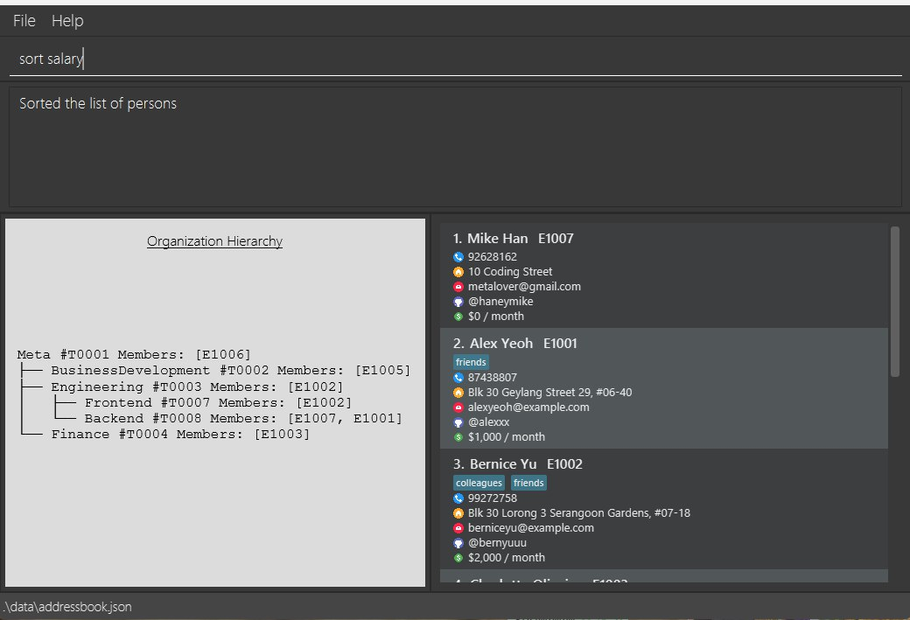

# Henri User Guide

Henri is a **desktop app for managing contacts, optimized for use via a  Line Interface** (CLI) while still having the benefits of a Graphical User Interface (GUI). If you can type fast, Henri can get your contact management tasks done faster than traditional GUI apps.

<!-- * Table of Contents -->
<page-nav-print />

--------------------------------------------------------------------------------------------------------------------

## Quick start

1. Ensure you have Java `17` or above installed in your Computer. 
   **Mac users:** Ensure you have the precise JDK version prescribed [here](https://se-education.org/guides/tutorials/javaInstallationMac.html).

2. Download the latest `.jar` file from [here](https://github.com/se-edu/addressbook-level3/releases).

3. Copy the file to the folder you want to use as the _home folder_ for your AddressBook.

4. Open a command terminal, `cd` into the folder you put the jar file in, and use the `java -jar henri.jar` command to run the application. 
   A GUI similar to the below should appear in a few seconds. Note how the app contains some sample data. 
   

5. Type the command in the command box and press Enter to execute it. e.g. typing **`help`** and pressing Enter will open the help window. 
   Some example commands you can try:

   * `list` : Lists all contacts.

   * `add -name John Doe -hp 98765432 -em johnd@example.com -addr John street, block 123, #01-01` : Adds a contact named `John Doe` to the Address Book.

   * `delete E1003` : Deletes the contact with the ID of "E1003" as shown in the current list.

   * `clear` : Deletes all contacts.

   * `exit` : Exits the app.

6. Refer to the [Features](#features) below for details of each command.

--------------------------------------------------------------------------------------------------------------------

## Features

<box type="info" seamless>

**Notes about the command format:** 

* Words in `UPPER_CASE` are the parameters to be supplied by the user. 
  e.g. in `add -name NAME`, `NAME` is a parameter which can be used as `add -name John Doe`.

* Items in square brackets are optional. 
  e.g `-name NAME [-tag TAG]` can be used as `-name John Doe -tag friend` or as `-name John Doe`.

* Items with `…`​ after them can be used multiple times including zero times. 
  e.g. `[-tag TAG]…​` can be used as ` ` (i.e. 0 times), `-tag friend`, `-tag friend -tag family` etc.

* Parameters can be in any order. 
  e.g. if the command specifies `-name NAME -hp PHONE_NUMBER`, `-hp PHONE_NUMBER -name NAME` is also acceptable.

* Extraneous parameters for commands that do not take in parameters (such as `help`, `list`, `exit` and `clear`) will be ignored. 
  e.g. if the command specifies `help 123`, it will be interpreted as `help`.

* If you are using a PDF version of this document, be careful when copying and pasting commands that span multiple lines as space characters surrounding line-breaks may be omitted when copied over to the application.
</box>

### Viewing help : `help`

Shows a message explaining how to access the help page.

Format: `help`

### Adding a person: `add`

Adds a person to the address book.

Format: `add -name NAME -hp PHONE_NUMBER -em EMAIL -addr ADDRESS [-gh GITHUB_USERNAME]`

#### Required Parameters
1. `-name` - name of the person being added to the address book (maximum 50 characters)
2. `-hp`   - numerical phone number of the person (3-12 digits)
3. `-em`   - email address in the format 'user@domain'
4. `-addr` - the address of the person in string format

#### Optional Parameters
1. `-gh` - the GitHub username string associated with the person (starts with '@', 3-39 characters)

Examples:
* `add -name John Doe -hp 98765432 -em johnd@example.com -addr John street, block 123, #01-01`
* `add -name Betsy Crowe -em betsycrowe@example.com -addr Newgate Prison -hp 1234567`
* `add -name Mike Oxlong -hp 96767676 -em mikeo@exammple.com -addr 67 Downing St -gh @mikeoxlong`

### Listing all persons : `list`

Shows a list of all persons in the address book.

Format: `list`

### Editing a person : `edit`

Edits an existing person in the address book.

Format: `edit EMPLOYEE_ID [-name NAME] [-hp PHONE] [-em EMAIL] [-addr ADDRESS] [-gh GITHUB_USERNAME]`

* Edits the person with the specified `EMPLOYEE_ID`. The employee ID starts with 'E" and is displayed next to the name in the displayed person list.
* At least one of the optional fields must be provided.
* Existing values will be updated to the input values.

#### Possible Parameters
1. `-name` - name of the person being added to the address book (maximum 50 characters)
2. `-hp`   - numerical phone number of the person (3-12 digits)
3. `-em`   - email address in the format 'user@domain'
4. `-addr` - the address of the person in string format
5. `-gh` - the GitHub username string associated with the person (starts with '@', 3-39 characters)

<box type="tip" seamless>

**Tip:** To remove the GitHub username of a person, use `-gh` with no username after the `-gh` prefix.
</box>

Examples:
*  `edit E1001 -hp 91234567 -em johndoe@example.com` Edits the phone number and email address of the person with the ID of "E1001" to be `91234567` and `johndoe@example.com` respectively.
*  `edit 2 -name Betsy Crower` Edits the name of the 2nd person to be `Betsy Crower`.

### Adding a tag: `tag`
Adds one or more tags to an existing person in the address book without removing existing tags.

Format: `tag EMPLOYEE_ID TAG [MORE_TAGS]…`

* Adds tags to the person identified by their `EMPLOYEE_ID`. 
* The employee ID must start with 'E' (e.g., E1001, E2050). 
* At least one tag must be provided. 
* Tags are added cumulatively - existing tags are preserved. 
* Multiple tags can be added at once by separating them with spaces. 
* Tags are case-insensitive - `Friends` and `friends` are treated as the same tag. 
* Tags must be alphanumeric and can contain hyphens between words (e.g., part-time, team-lead). 
* Tags must be between 1-20 characters in length. 
* Tags cannot contain whitespaces. 
* If you attempt to add duplicate tags (including case variations), only the new tags will be added and a warning will be shown.

Examples:
* `tag E1001 friends` Adds the tag "friends" to the employee with ID E1001.
* `tag E2050 colleagues mentor` Adds both "colleagues" and "mentor" tags to employee E2050.
* `tag E1001 team-lead part-time` Adds hyphenated tags to employee E1001.
* `tag E2050 Friends colleagues` If employee E2050 already has a "friends" tag (in any case variation), only "colleagues" will be added and a warning will show that "Friends" is a duplicate.

Note: 
* Tags are case-insensitive. Adding Boardgames to a person who already has boardgames will be detected as a duplicate and ignored.

Warning: 
* If all tags you attempt to add are duplicates, the command will return a message indicating no new tags were added.

### Removing a tag: `untag`

Removes one or more tags from an existing person in the address book.

Format: `untag EMPLOYEE_ID TAG [MORE_TAGS]…`

* Removes tags from the person identified by their `EMPLOYEE_ID`. 
* The employee ID must start with 'E' (e.g., E1001, E2050). 
* At least one tag must be provided. 
* Tags are case-insensitive - `Friends` and `friends` are treated as the same tag. 
* Multiple tags can be removed at once by separating them with spaces. 
* The command will show which tags were successfully removed. 
* If some tags don't exist on the person, a warning will be shown indicating which tags were not found, but valid tags will still be removed. 
* If all specified tags don't exist on the person, an error will be shown and no tags will be removed.

Examples:
* `untag E1001 friends` Removes the tag "friends" from employee E1001.
* `untag E2050 colleagues mentor` Removes both "colleagues" and "mentor" tags from employee E2050.
* `untag E1001 team-lead` Removes the hyphenated tag "team-lead" from employee E1001.
* `untag E2050 Friends` Removes the tag "friends" (case-insensitive) from employee E2050, even if it was originally added as "friends".

Note: 
* Tag removal is case-insensitive. Removing Boardgames from a person who has boardgames will successfully remove that tag.

Warning: 
* If none of the specified tags exist on the person, the command will fail with an error message listing the non-existent tags. However, if at least one tag exists, valid tags will be removed and a warning will show which tags were not found.

### Creating a team: `create-team`
Adds a team to the address book.

Format: `create-team TEAM_NAME TEAM_LEADER_ID`

Example:
* `create-team Systems E1001` creates a team named `Systems` with the person having employee ID `E1001` as the team leader.

### Adding members to a team: `add-to-team`
Adds a peron to an existing team in the address book.

Format: `add-to-team TEAM_ID MEMBER_ID`

Example:
* `add-to-team T0001 E1002` adds the person with employee ID `E1002` to the team with team ID `T0001`.

Exceptions:
* If the team ID or member ID does not exist, the command will fail with an error message.

### Removing members from a team: `remove-from-team`
Remove a person from an existing team in the address book.

Format: `remove-from-team TEAM_ID MEMBER_ID`

Example:
* `remove-from-team T0001 E1002` removes the person with employee ID `E1002` from the team with team ID `T0001`.

Exceptions:
* If the member to be removed is the team leader, the command will fail with an error message.
* If the member to be removed is not part of the team, the command will fail with an error message.
* If the team ID or member ID does not exist, the command will fail with an error message.

### Set a team as a subteam of another team: `set-subteam`

Sets an already created team as a subteam of another already created parent team.
The parent team must not already contain the subteam as a subteam (directly or indirectly) to avoid cycles.
The subteam must also not already contain the parent team as a subteam (directly or indirectly) to avoid cycles.

Format: `set-subteam PARENT_TEAM_ID SUBTEAM_ID`

### Deleting a team `delete-team`
Deletes an existing team from the address book.

Format: `delete-team TEAM_ID`

Example:
* `delete-team T0001` deletes the team with team ID `T0001`.

Exceptions:
* If the team ID does not exist, the command will fail with an error message.
* If the team to be deleted has subteams, the command will fail with an error message.

Format: `remove-team TEAM_ID`

### Locating persons by name: `view`

Finds persons whose names contain any of the given keywords.

Format: `view KEYWORD [MORE_KEYWORDS]`

* The search is case-insensitive. e.g `hans` will match `Hans`
* The order of the keywords does not matter. e.g. `Hans Bo` will match `Bo Hans`
* Only the name is searched.
* Partial matches are allowed. e.g. `ann` will match `Annabel` and `Joanna`
* Persons matching at least one keyword will be returned (i.e. `OR` search).
  e.g. `Hans Bo` will return `Hans Gruber`, `Bo Yang`
* Ordering of result is based on keyword. 
  * sorts filtered persons by:
    1) Number of matched keywords (more matches first)
    2) Closeness of match (exact > word > substring)
    3) Order of keyword appearance in the input
    4) Last by name in case-insensitive alphabetical order

Examples:
* `view John` returns `john` and `John Doe`
* `view alex david` returns `Alex Yeoh`, `David Li` 
  

### Deleting a person : `delete`

Deletes the specified person from the address book.

Format: `delete INDEX`

* Deletes the person at the specified `INDEX`.
* The index refers to the index number shown in the displayed person list.
* The index **must be a positive integer** 1, 2, 3, …​

Examples:
* `list` followed by `delete 2` deletes the 2nd person in the address book.
* `view Betsy` followed by `delete 1` deletes the 1st person in the results of the `view` command.

### Setting a person's salary: `set-salary`

Sets the salary of the specified person in the address book.

Format: `set-salary EMPLOYEE_ID SALARY`

* Sets the salary of the person with the specified `EMPLOYEE_ID` to the specified `SALARY`.
* The employee ID starts with "E" and is displayed next to the name in the displayed person list.
* The salary must be a positive number representing the **monthly salary in dollars**.
* The salary may contain decimal places, but it will be rounded to two decimal places.

Examples:
* `set-salary E1001 1000` sets the salary of the person with the ID of "E1001" to *$1000 / month*.
* `set-salary E2050 3550.61` sets the salary of the person with the ID of "E2050" to *$3550.61 / month*.
* `set-salary E1001 4000.247` sets the salary of the person with the ID of "E1001" to *$4000.25 / month*.

### Sorting persons: `sort`

Sorts the persons in the address book by the specified fields.

Format: `sort -FIELD [-MORE_FIELDS]`

* Sorts the persons in the address book by the specified fields.
* The fields are case-sensitive and must be from the following:
  * `name` - sorts by name in alphabetical order
  * `hp` - sorts by phone number in numerical order
  * `em` - sorts by email address in alphabetical order
  * `addr` - sorts by address in alphabetical order
  * `salary` - sorts by salary in numerical order
  * `gh` - sorts by GitHub username in alphabetical order
  * `id` - sorts by employee ID in numerical order
* The fields can be specified multiple times, although this should not be necessary for any use case.
* The fields can be specified in any order. The order of the fields determines their priority in comparing two persons.
* The default sorting is by name in alphabetical order.
* The persons are always sorted in ascending order.

Examples:
* `sort -name -salary` sorts the persons in the address book by name in alphabetical order, then by salary in numerical order.
* `sort -salary -gh` sorts the persons in the address book by salary in numerical order, then by GitHub username in alphabetical order.
* `sort` sorts the persons in the address book by name in alphabetical order.

### Clearing all entries : `clear`

Clears all entries from the address book.

Format: `clear`

### Importing contacts from data file : `import`

Imports contact data from a specific JSON file from the data folder into the main address book.

Format: `import FILENAME.json`

- The file must be located inside the 'data' folder
- The command must include the '.json' file extension
- JSON format from the file must be valid
- Duplicate contacts with the same employee ID will not be imported

Example:
- `import oldContacts.json` imports non-duplicate contacts from 'data/oldContacts.json' into the address book.

### Viewing of audit logs : `audit`

Displays a log of all past actions that have modified the address book data.

Format: `audit`

* Shows a chronological list of all commands that have changed the address book state.
* Each entry includes:
  * The action type (e.g., ADD, DELETE, EDIT, CLEAR)
  * Details of what was changed 
  * Timestamp of when the action occurred
* Read-only commands (like list, find, view, help, exit) are not logged. 
* If no actions have been performed, displays "No audit log entries found."

Examples:
* `audit` displays all logged actions in chronological order.

Note: 
* The audit log persists between sessions and survives application restarts. Only commands that modify data are recorded to keep the log meaningful and concise.

### Exiting the program : `exit`

Exits the program.

Format: `exit`

### Saving the data

AddressBook data are saved in the hard disk automatically after any command that changes the data. There is no need to save manually.

### Editing the data file

AddressBook data are saved automatically as a JSON file `[JAR file location]/dat-addr addressbook.json`. Advanced users are welcome to update data directly by editing that data file.

<box type="warning" seamless>

**Caution:**
If your changes to the data file makes its format invalid, AddressBook will discard all data and start with an empty data file at the next run.  Hence, it is recommended to take a backup of the file before editing it. 
Furthermore, certain edits can cause the AddressBook to behave in unexpected ways (e.g., if a value entered is outside the acceptable range). Therefore, edit the data file only if you are confident that you can update it correctly.
</box>

### Archiving data files `[coming in v2.0]`

_Details coming soon ..._

--------------------------------------------------------------------------------------------------------------------

## FAQ

**Q**: How do I transfer my data to another Computer? 
**A**: Install the app in the other computer and overwrite the empty data file it creates with the file that contains the data of your previous AddressBook home folder.

--------------------------------------------------------------------------------------------------------------------

## Known issues

1. **When using multiple screens**, if you move the application to a secondary screen, and later switch to using only the primary screen, the GUI will open off-screen. The remedy is to delete the `preferences.json` file created by the application before running the application again.
2. **If you minimize the Help Window** and then run the `help` command (or use the `Help` menu, or the keyboard shortcut `F1`) again, the original Help Window will remain minimized, and no new Help Window will appear. The remedy is to manually restore the minimized Help Window.

--------------------------------------------------------------------------------------------------------------------

## Command summary

| Action                | Format, Examples                                                                                                                                                                                              |
|-----------------------|---------------------------------------------------------------------------------------------------------------------------------------------------------------------------------------------------------------|
| **Add**               | `add -name NAME -hp PHONE_NUMBER -em EMAIL -addr ADDRESS [-gh GITHUB_USERNAME]`   e.g., `add -name James Ho -hp 22224444 -em jamesho@example.com -addr 123, Clementi Rd, 1234665 -tag friend -gh @jamesho` |
| **Clear**             | `clear`                                                                                                                                                                                                       |
| **Delete**            | `delete INDEX`  e.g., `delete 3`                                                                                                                                                                           |
| **Find**              | `find KEYWORD [MORE_KEYWORDS]`  e.g., `find James Jake`                                                                                                                                                    |
| **Import**            | `import FILENAME.json`  e.g., `import oldContacts.json`                                                                                                                                                    |
| **List**              | `list`                                                                                                                                                                                                        |
| **Help**              | `help`                                                                                                                                                                                                        |
| **View**              | `view KEYWORD [MORE_KEYWORDS]`  e.g., `view James Jake`
| **create-team**       | `create-team TEAM_NAME TEAM_LEADER_ID`  e.g., `create-team DevTeam E1001`
| **delete-team**       | `delete-team TEAM_ID`  e.g., `delete-team T0001`
| **add-to-team**       | `add-to-team TEAM_ID MEMBER_ID`  e.g., `add-to-team T0001 E1002`
| **remove-from-team**  | `remove-from-team TEAM_ID MEMBER_ID`  e.g., `remove-from-team T0001 E1002`
| **Audit**             | `audit`
| **Exit**              | `exit`
 